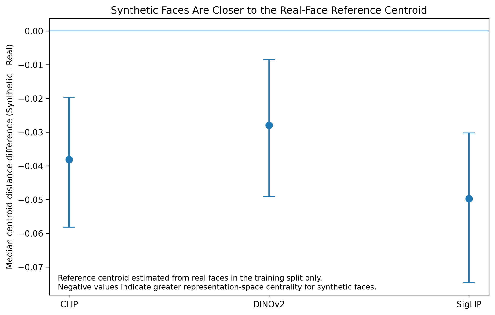

# FacePercept-Bench

A small computational experiment comparing real and AI-generated faces using current vision and vision-language models.

## Main result

I ran the analysis on 500 faces (250 real and 250 synthetic). For CLIP, DINOv2 and SigLIP, synthetic faces were closer to a reference centroid computed from real faces in the training split. At the same time, real and synthetic faces were still fairly easy to separate with a linear probe.

| Encoder | Linear-probe balanced accuracy | Synthetic - Real centroid distance | 95% CI |
|---|---:|---:|---:|
| CLIP | 0.844 | -0.0381 | [-0.0582, -0.0196] |
| DINOv2 | 0.862 | -0.0279 | [-0.0490, -0.0085] |
| SigLIP | 0.868 | -0.0497 | [-0.0746, -0.0302] |



This made me interested in a simple question: does this kind of centrality in vision-model feature space have any relationship to perceptual averageness or the hyper-realism effects reported for AI-generated faces in humans?

The representation analysis is only a computational comparison. I am not treating model feature space as equivalent to human perception.

## VLM result

I also tested Qwen2.5-VL-3B. It predicted REAL for almost everything: 98.4% of synthetic faces and 98.0% of real faces. Balanced accuracy was 0.498 and the 95% CI for the difference was [-0.020, 0.028]. I therefore treat this as a near-constant response rather than evidence of a hyper-realism effect.

## Included

- real/synthetic face dataset loading and balancing
- fixed train/test splits
- VLM classification
- CLIP, DINOv2 and SigLIP embeddings
- distance to a real-face training centroid
- linear-probe evaluation
- bootstrap confidence intervals and effect sizes
- saved results and figures

## Running it

```bash
python -m venv .venv
# Windows
.venv\Scripts\activate
pip install -e ".[models,extra]"
python run_all.py --quick
```

For the full model run:

```bash
python run_all.py --model qwen2_5_vl_3b --embedding-backend clip_vit_b32 --n-per-class 250
```

## Demo

https://face-percept-bench.vercel.app/

## Scope

This project is about real-vs-synthetic classification and representation geometry. It does not do face identification, demographic inference, attractiveness/personality scoring, or other sensitive face analysis.
